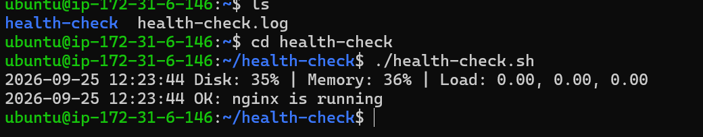
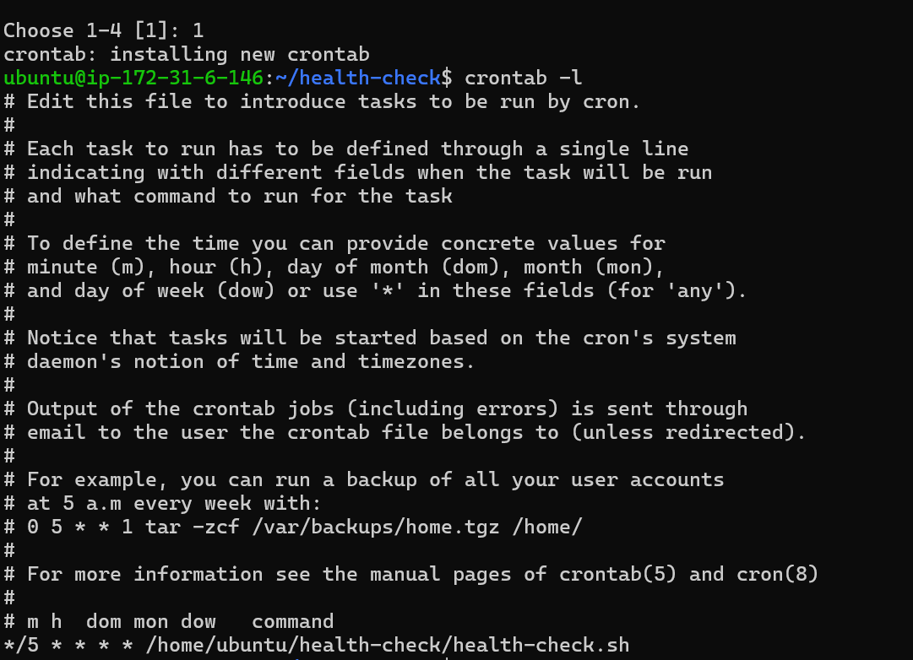
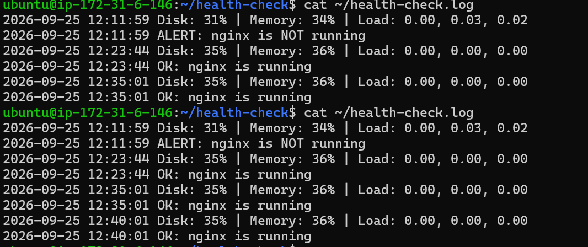
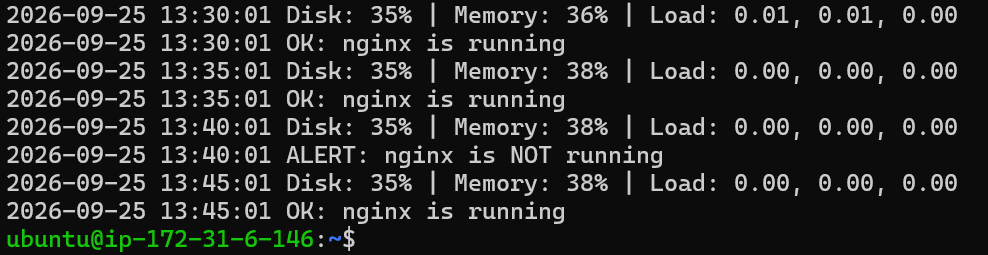
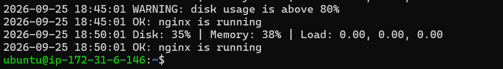

# Linux Server Health Check & Automated Monitoring

A Bash script that monitors disk usage, memory usage, system load, and the Nginx service on a Linux server, automated with **cron** so it runs on its own. I tested it by simulating two real failures and documenting how I detected and fixed each one.

**Built by:** Mohit Chauhan

---

## What it does

- Checks **disk usage**, **memory usage**, and **system load**
- Checks whether the **Nginx service** is running
- Logs every check with a timestamp to `health-check.log`
- Raises a **WARNING** if disk or memory usage goes above 80%
- Raises an **ALERT** if Nginx is not running
- Runs automatically every 5 minutes via **cron**, with no manual action needed

## Environment

| Item | Value |
|---|---|
| OS | Ubuntu Server (EC2) |
| Scripting | Bash |
| Scheduler | cron |
| Monitored service | Nginx |

## The script

```bash
#!/bin/bash
# health-check.sh - checks disk, memory, load and Nginx status

LOG_FILE="$HOME/health-check.log"
DISK_LIMIT=80
MEM_LIMIT=80
SERVICE="nginx"

log() {
  echo "$(date '+%Y-%m-%d %H:%M:%S') $1" | tee -a "$LOG_FILE"
}

DISK_USED=$(df / | awk 'NR==2 {print $5}' | tr -d '%')
MEM_USED=$(free | awk '/Mem:/ {printf "%.0f", $3/$2*100}')
LOAD=$(uptime | awk -F'load average: ' '{print $2}')

log "Disk: ${DISK_USED}% | Memory: ${MEM_USED}% | Load: ${LOAD}"

if [ "$DISK_USED" -ge "$DISK_LIMIT" ]; then
  log "WARNING: disk usage is above ${DISK_LIMIT}%"
fi

if [ "$MEM_USED" -ge "$MEM_LIMIT" ]; then
  log "WARNING: memory usage is above ${MEM_LIMIT}%"
fi

if systemctl is-active --quiet "$SERVICE"; then
  log "OK: $SERVICE is running"
else
  log "ALERT: $SERVICE is NOT running"
fi
```

Full file: [`health-check.sh`](health-check.sh)

## Automation with cron

```
*/5 * * * * /home/ubuntu/health-check/health-check.sh
```

This runs the script every 5 minutes, so the server monitors itself without anyone logged in.

## Incidents I simulated and resolved

Full write-up: [`troubleshooting-log.md`](troubleshooting-log.md)

### Incident 1: Nginx service stopped
- **What I did:** Ran `sudo systemctl stop nginx` to simulate a service failure.
- **How I detected it:** The next cron run logged `ALERT: nginx is NOT running`.
- **How I fixed it:** Ran `sudo systemctl start nginx`.
- **How I confirmed the fix:** The following cron run logged `OK: nginx is running`, and the website loaded again in the browser.

### Incident 2: Disk usage spike
- **What I did:** Created a large file with `fallocate` to push disk usage above 80%.
- **How I detected it:** The script logged `WARNING: disk usage is above 80%`.
- **How I fixed it:** Deleted the file with `rm`.
- **How I confirmed the fix:** The next cron run showed normal disk usage with no warning.

## Screenshots

**1. Manual run of the script**


**2. Cron job scheduled**


**3. Log growing automatically (proves cron is running the script on its own)**


**4. Nginx stopped, detected, and recovered**


**5. Disk usage warning, then resolved**


## What I learned

- Writing a Bash script that checks system health and logs results
- Automating tasks with cron, and why silent scheduling failures matter
- The difference between a script that only reports status and one that raises warnings and alerts
- Simulating real failures to test monitoring, instead of assuming it works
- Documenting an incident clearly: what broke, how it was found, how it was fixed, how the fix was confirmed
